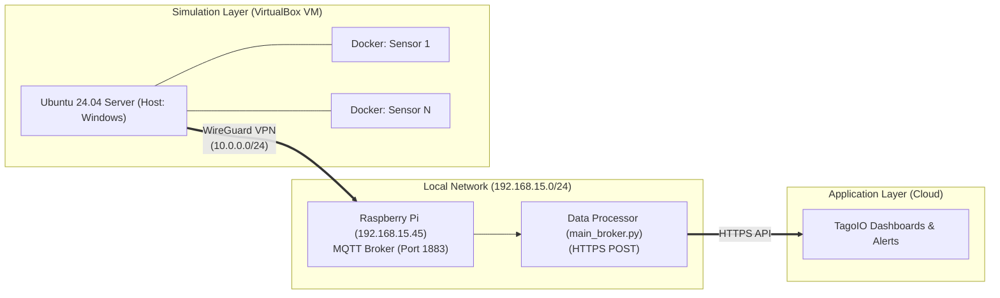

# 🚗 Distributed Smart Parking IoT
**MQTT Broker over WireGuard and TagoIO Integration**


## 📖 About the Project

This project presents a distributed architecture for a **Smart Parking System** tailored for Smart Cities. By leveraging dozens of independent Docker containers, the system simulates the dynamic real-time behavior of parking spots.

The simulated sensor data is transmitted efficiently via the **MQTT protocol**, tunneled securely through a **WireGuard VPN** to a local MQTT Broker hosted on a Raspberry Pi. From there, a data processor validates business rules (e.g., parking time limits) and sends the payloads via HTTPS POST to the **TagoIO** cloud platform for real-time dashboard visualization and automated email alerts.

## 🏗️ Architecture & Network Topology

The ecosystem is divided into three main layers, connected via a secure VPN tunnel to overcome local network routing constraints.



## 📂 Repository Structure

* `main.py` / `main_second.py`: The core simulator scripts. They implement the Finite State Machine (FSM) logic for the parking spots, using the `paho-mqtt` library to publish events to the broker.
* `gerar_compose.py`: A Python utility script that dynamically generates the `docker-compose.yml` file. It allows you to effortlessly scale the simulation to dozens of containers/sensors by simply changing a few variables in the code.
* `main_broker.py`: The edge data processor. It subscribes to the local Mosquitto broker, calculates network metrics, applies business rules, and bridges the local network to the TagoIO cloud.
* `Dockerfile`: Defines a lightweight image based on `python:3.11-slim` to encapsulate the application and automatically install required dependencies.
* `docker-compose.yml`: The generated manifest configuring environment variables (such as `MQTT_BROKER`, `ID_SENSOR`, `NUM_VAGA`) and setting the network to *host mode* for easier VPN routing.
* `LICENSE`: MIT License terms.

## 🧠 Data Processor & Cloud Bridge (`main_broker.py`)

The `main_broker.py` script acts as the vital middleman between the local IoT network and the TagoIO platform. Its core responsibilities include:

* **MQTT Subscription:** It listens to the wildcard topic (`estacionamento1/#`) to capture all incoming sensor events from the WireGuard tunnel.
* **Real-time Network Auditing:** It dynamically calculates telemetry and network health metrics, including `latency_ms`, `latency_variation_ms` (jitter), `msg_rate`, `throughput_bps`, and `packet_loss`.
* **Business Rules Engine:** It maps the incoming `employee_type` to specific parking duration limits (e.g., 60, 240, or 480 minutes).
* **Cloud Integration:** It packages the raw JSON payloads into TagoIO's native format and pushes the enriched data securely via HTTPS POST using a specific Device Token.

## ⚙️ MQTT Payload Format

Each sensor publishes a JSON message at every state transition. The payload follows this structure:

```json
{
  "sensor_id": "sensor_1",
  "timestamp": 1717084500,
  "plate": "ABC-1234",
  "employee_type": 2,
  "state": 1
}
```
* *`state: 1` = Occupied | `state: 0` = Empty*

> `` *(Add your state machine image to the docs folder)*

## 🚀 How to Run Locally

### Prerequisites
* **Docker** and **Docker Compose** installed on your machine.
* **Python 3.11+** (to run the setup and broker scripts) and the `paho-mqtt` & `requests` libraries.
* An active **MQTT Broker** (can be local or accessible via VPN, like the WireGuard setup on IP `10.0.0.2` used in this project).

### Step-by-Step Guide

1. **Clone the repository:**
   ```bash
   git clone [https://github.com/henriquebueno45/Distributed-Smart-Parking-with-MQTT-Broker-over-WireGuard-and-TagoIO-Integration.git](https://github.com/henriquebueno45/Distributed-Smart-Parking-with-MQTT-Broker-over-WireGuard-and-TagoIO-Integration.git)
   cd Distributed-Smart-Parking-with-MQTT-Broker-over-WireGuard-and-TagoIO-Integration
   ```

2. **Start the Data Processor (Broker Bridge):**
   Run the processor locally (or on your Raspberry Pi) to start listening to the MQTT Broker and forwarding data to TagoIO.
   ```bash
   python main_broker.py
   ```

3. **Configure the Simulation Scale:**
   If you want to change the number of parking spots, edit the `NUM_CONTAINERS` and `SENSORS_PER_CONTAINER` variables inside the `gerar_compose.py` script. Then, generate the new manifest:
   ```bash
   python gerar_compose.py
   ```

4. **Build and Start the Sensor Containers:**
   Run the simulation containers in detached mode:
   ```bash
   docker-compose up --build -d
   ```

5. **Monitor the Logs:**
   To watch the state transitions (Empty -> Occupied) and MQTT publications in real-time:
   ```bash
   docker-compose logs -f
   ```

## ⚠️ WireGuard & Virtual Machine Troubleshooting

If you are running the WireGuard server on an **Ubuntu Server 24 VM** using **VirtualBox** on a **Windows** host, you might experience the VPN tunnel dropping when the host computer's screen locks or is idle for a while. To prevent this, ensure the following steps are taken:

1. Add `PersistentKeepalive = 25` to your WireGuard client/server configuration to maintain the handshake.
2. Disable **Hibernation** and **Sleep/Suspension** completely in the Windows host power settings.
3. In the Windows Device Manager, go to the Network Adapters, open properties, and uncheck *"Allow the computer to turn off this device to save power"*.
4. If the connection still drops after a while, verify if there are any remaining energy-saving options active within VirtualBox itself or within the Ubuntu Server 24 VM that might be hibernating network interfaces or freezing processes.

## 📊 Dashboards in TagoIO

The cloud integration allows for real-time visualization of the parking spots and network auditing. 

*(Replace the paths below with your actual image paths once uploaded to the repo's docs folder)*
> ``
> ``

## 🎓 Authors & Acknowledgments

Academic project developed by **Dener Kraus**, **Henrique Bueno**, and **Lucas Bueno**.

This work fulfills the final project requirements for the **Wireless Sensor Networks for IoT** course (Postgraduate Program - PPGCC / EEL), taught by Professor Richard Demo Souza at the Federal University of Santa Catarina (UFSC).

## 📄 License

Distributed under the MIT License. See the [LICENSE](LICENSE) file for more information. (Copyright © 2026 Dener Kraus, Henrique Bueno de Morais, and Lucas Bueno).